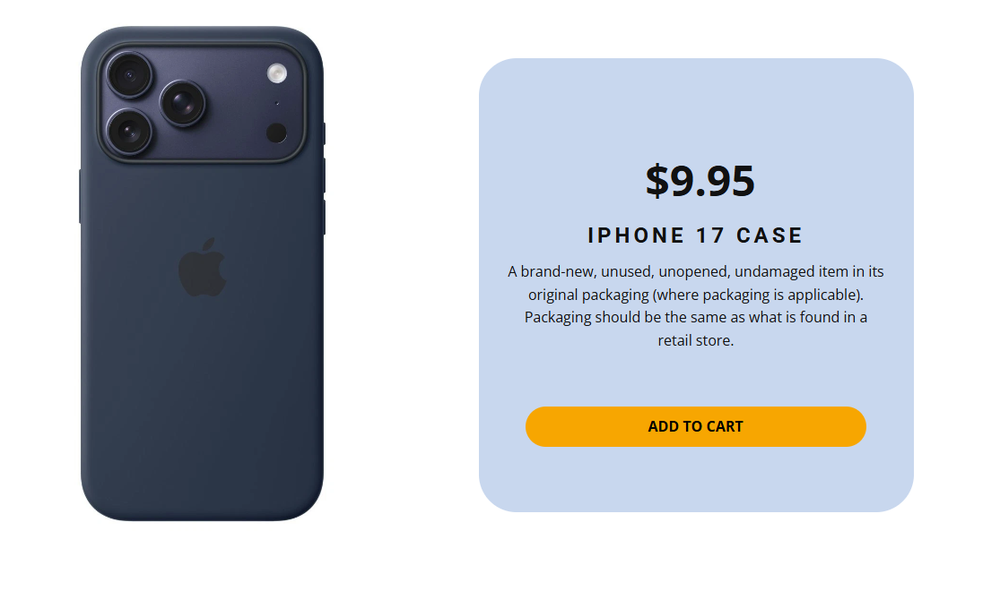
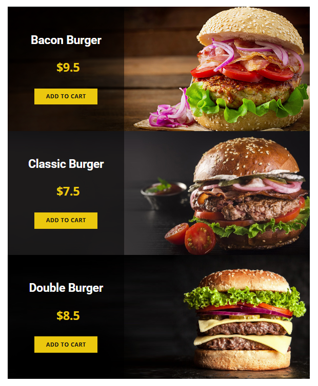

# დავალება 1

## მოცემული  დიზაინის მიხედვით ჯავასკრიპტის ობიექტის დახმარებით გააკეთეთ ვებ-გვერდი. 


## სურათი გადმოწერეთ case.jpg

# დავალება 2 
https://nicepage.com/website-templates/preview/ocean-travel-86000?device=desktop
## დიზაინის და ამ მონაცემების მიხედვით ჯავასკრიპტიდან გააკეთეთ ვებ-გვერდი

```javascript 
[
  {
    name: "Product 1",
    description:
      "Sample text. Lorem ipsum dolor sit amet, consectetur adipiscing elit nullam nunc justo sagittis suscipit ultrices.",
    price: 17.00,
    image:
      "https://assets.nicepagecdn.com/11a8ddce/85995/images/pexels-photo-1450082.jpeg"
  },
  {
    name: "Product 2",
    description:
      "Sample text. Lorem ipsum dolor sit amet, consectetur adipiscing elit nullam nunc justo sagittis suscipit ultrices.",
    price: 245.00,
    image:
      "https://assets.nicepagecdn.com/11a8ddce/85995/images/pexels-photo-1680140.jpeg"
  },
  {
    name: "Product 3",
    description:
      "Sample text. Lorem ipsum dolor sit amet, consectetur adipiscing elit nullam nunc justo sagittis suscipit ultrices.",
    price: 19.00,
    image:
      "https://assets.nicepagecdn.com/11a8ddce/85995/images/pexels-photo-392586.jpg"
  }
]
```

# დავალება 3 

https://nicepage.com/website-templates/preview/burger-menu-5805552?device=desktop


ფოტოები გადმოწერეთ დავალება 3-ს ფოლდერიდან, შექმენით JS-ში მონაცემების შესაბამისი მასივი და ობიექტები..

