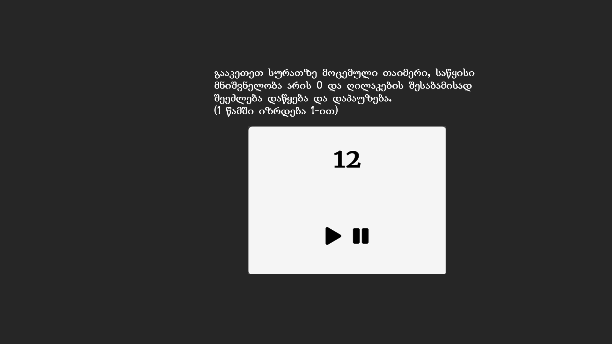

# დავალება 1

 დაბეჭდეთ ყოველ 2 წამში 10-დან 15-ის ჩათვლით ციფრები

# დავალება 2

დაბეჭდეთ ყოველ 1 წამში 5-დან უკუთვლით 1-ის ჩათვლით ციფრები. 1-ის შემდეგ დაეწეროს "Go" და გაჩერდეს

# დავალება 3

გამოიტანეთ ამჟამინდელი `საათი:წუთი:წამი` და განახლდეს ავტომატურად (ყოველ 1 წამში)

# დავალება 4

