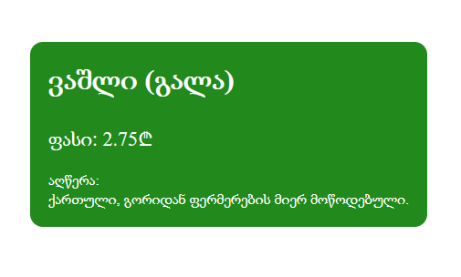

# დავალება 1

გააკეთეთ ობიექტი სადაც მოცემული იქნება პოსტის სათაური, აღწერა და ავტორის სახელი გვარი. მოცემული ინფორმაცია დაბეჭდეთ დოკუმენტში სასურველი დიზაინით.

# დავალება 2

გააკეთეთ ობიექტი სადაც მოცემული იქნება პროდუქტზე ინფორმაცია, (სახელი) `ვაშლი`, (აღწერა) `ქართული, გორიდან ფერმერების მიერ მოწოდებული.`, 
(ჯიში) `გალა`, (ფასი) `2.75`. დაბეჭდეთ მოცემული ინფორმაცია ფოტოზე მოცემული ვიზუალით

# დავალება 3 

წინა დავალების ობიექტს დაუმატეთ რამდენიმე ობიექტი, ჩასვით მასივში და html გვერდზე გამოაჩინეთ 3-3 სვეტად, გაუკეთეთ რესფონსივიც

----
 - - 
-----

# დავალება 4 

***შეადგინეთ ობიექტების მასივი:*** პროდუქტების სია (`სახელი, ფასი, აღწერა`).  
***დავალება:*** დაბეჭდეთ იმ პროდუქტების სრული ინფორმაცია, რომლებიც `ღირს 4.55-ზე ნაკლები`
